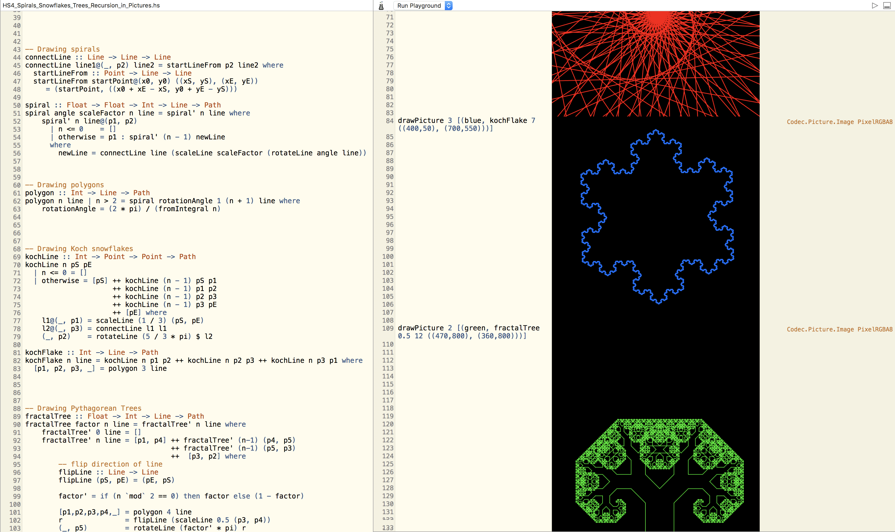

# Learning Haskell @ [learn.hfm.io](http://learn.hfm.io/)

Notes on [Learning Haskell](http://learn.hfm.io/) by [Gabriele Keller](https://twitter.com/gckeller) and [Manuel M T Chakravarty](https://twitter.com/TacticalGrace).

You can use [Haskell for Mac](http://haskellformac.com/) to open .hsproj files

**The Basics of Haskell (We don’t assume anything — let’s start right at the beginning.)**

1. [First Steps](http://learn.hfm.io/first_steps.html)
2. [Fundamentals](http://learn.hfm.io/fundamentals.html)
3. [Recursion](http://learn.hfm.io/recursion.html)
4. [Spirals, Snowflakes & Trees: Recursion in Pictures](http://learn.hfm.io/fractals.html)
 

**Cornerstones of Functional Programming (Finding out what the fuss is all about.)**

5. [Higher-order Functions](http://learn.hfm.io/higher_order.html)
6. [Algebraic Data Types](http://learn.hfm.io/datatypes.html)
7. [More About Algebraic Data Types](http://learn.hfm.io/recursive_datatypes.html)
8. [Expression Trees](http://learn.hfm.io/expressions.html)

