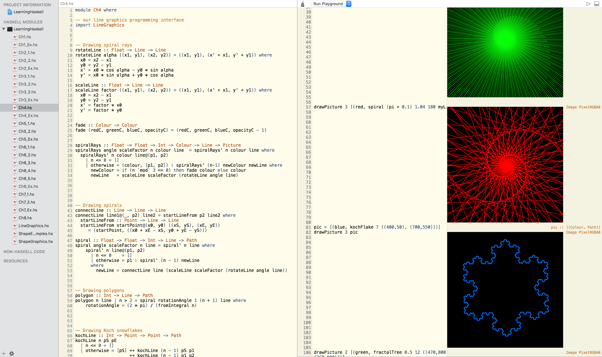
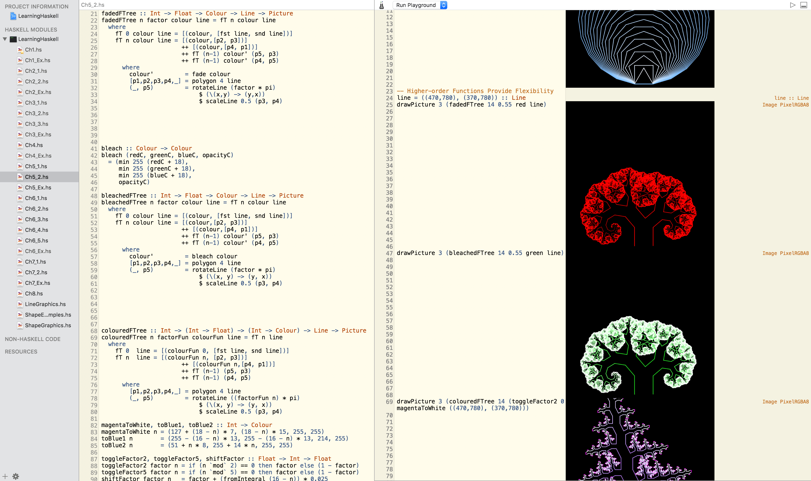

You can use [Haskell for Mac](http://store.haskellformac.com/) to open .hsproj files

# Learning Haskell.hsproj

Notes on [Learning Haskell](http://learn.hfm.io/) by [Gabriele Keller](https://twitter.com/gckeller) and [Manuel M T Chakravarty](https://twitter.com/TacticalGrace).

**Table of Contents**

The Basics of Haskell

1. [First Steps](http://learn.hfm.io/first_steps.html)
2. [Fundamentals](http://learn.hfm.io/fundamentals.html)
3. [Recursion](http://learn.hfm.io/recursion.html)
4. [Spirals, Snowflakes & Trees: Recursion in Pictures](http://learn.hfm.io/fractals.html)
 

Cornerstones of Functional Programming

5. [Higher-order Functions](http://learn.hfm.io/higher_order.html)
6. [Algebraic Data Types](http://learn.hfm.io/datatypes.html)
7. [More About Algebraic Data Types](http://learn.hfm.io/recursive_datatypes.html)
8. [Expression Trees](http://learn.hfm.io/expressions.html)

# Learn Haskell in One Video.hsproj
Notes on [Learn Haskell in One Video](https://youtu.be/02_H3LjqMr8) by [Derek Banas
](https://www.youtube.com/channel/UCwRXb5dUK4cvsHbx-rGzSgw)

**Covered Topics**

Installation, Data Types, Math Functions, :t, Lists, : Operator, Head / Tail, !! Operator, Take, Elem, Creating Ranges, Cycle, Filter, ZipWith, TakeWhile, Foldl, List Comprehensions, Tuples, Zip, Functions, Compiling, Type Declarations, Recursive Functions, Guards, Where, (x:y), As, Higher Order Functions, Map, (x:xs), Passing a Function into a Function, Returning a Function, Lambda, If, Case, Modules, Enumerations, Polymorphic Types, $ Operator, . Operator, Type Classes, Type Instance, Custom Typeclass, File I/O, Fibonacci Sequence and more.

